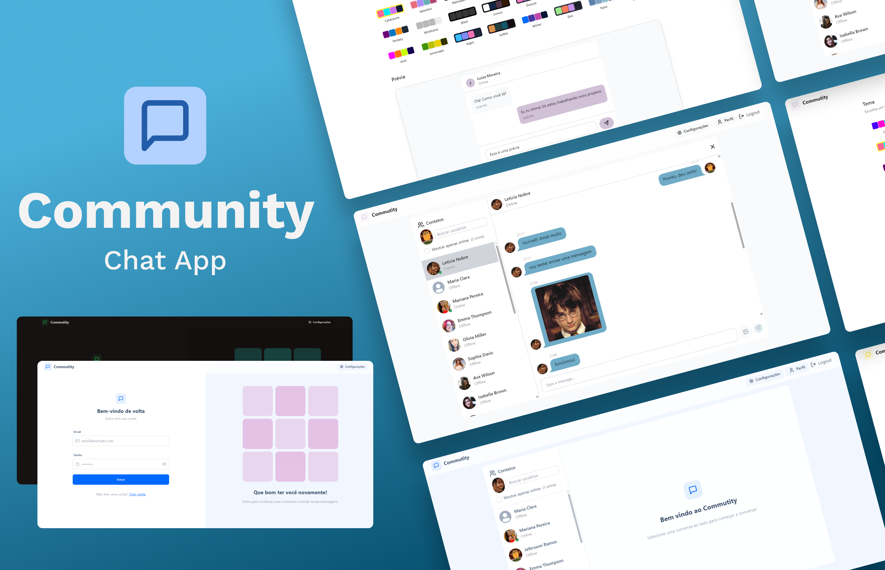

# Community Chat App

A real-time chat application that allows users to communicate seamlessly with real-time messaging and secure authentication.

## Features

- **Real-time Messaging**: Instant communication using Socket.IO.
- **User Authentication**: Secure login and signup using JWT.
- **Responsive Design**: Optimized for both desktop and mobile devices.
- **Cloudinary Integration**: Image uploads handled through Cloudinary.

## Tech Stack

### Frontend
- **ReactJS**: Component-based user interface.
- **Zustand**: State management.
- **Axios**: API requests.
- **Socket.IO Client**: Real-time communication.

### Backend
- **Node.js**: Backend runtime.
- **Express.js**: Web framework.
- **MongoDB**: Database for storing user and message data.
- **Mongoose**: Object Data Modeling (ODM) library.
- **Socket.IO**: Real-time communication.
- **Cloudinary**: Image hosting.
- **JWT**: Secure user authentication.

## License

This project is licensed under the MIT License.
